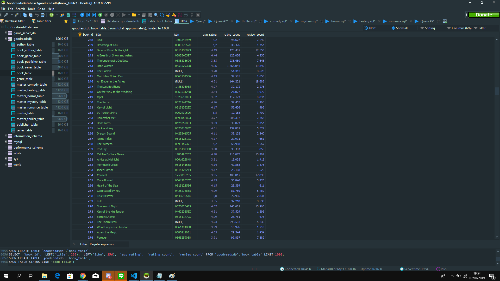
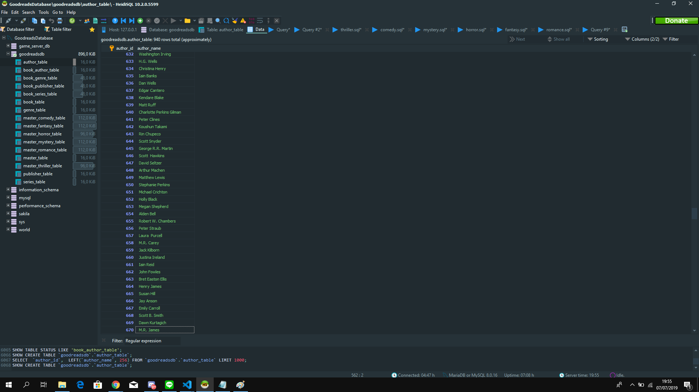
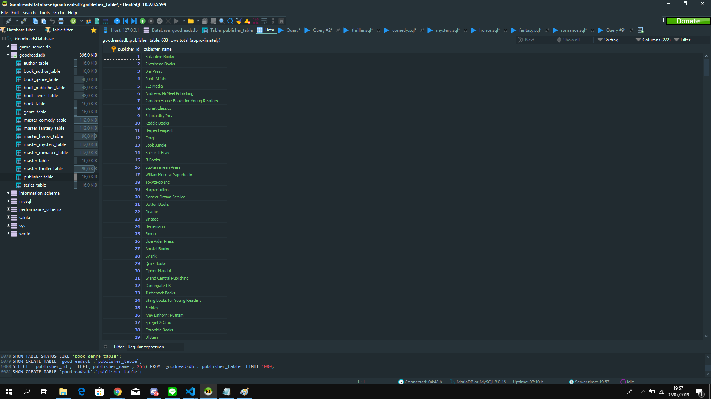
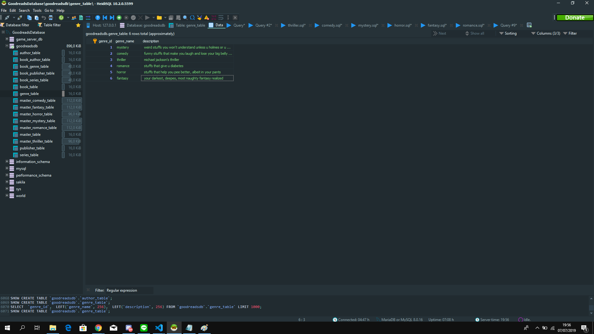
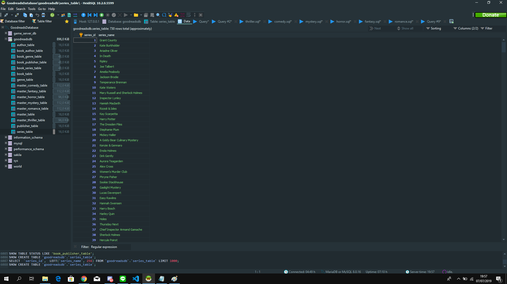
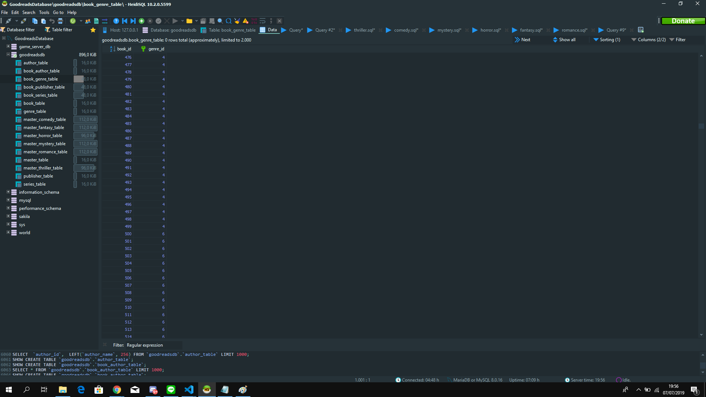
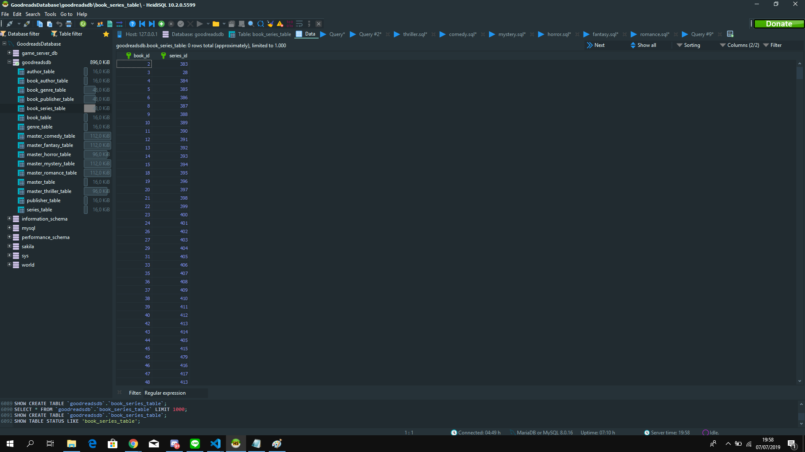
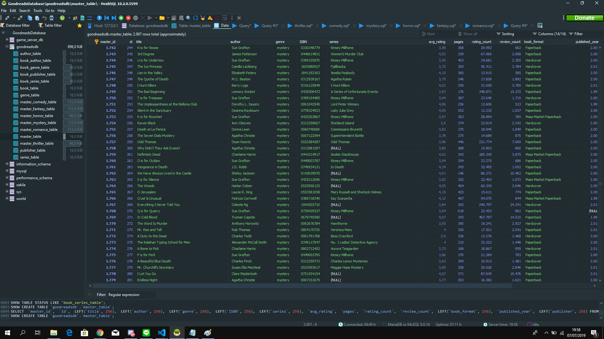

<h1 align="center">
   
  Seleksi 2 Warga Basdat 2019
   
   
</h1>

<h2 align="center">
   
  Data Storing
   
   
</h2>

### 1. Description of the DBMS and reasons:

Database Management System yang saya gunakan bersifat SQL, yaitu MySQL. Saya menggunakan tools untuk membantu saya menyimpan data yaitu dengan HeidiSQL. Alasan saya memilih SQL dibandingkan dengan NoSQL karena saya sudah merancang skema yang jelas untuk struktur database yang saya gunakan untuk menyimpan data Top Books Goodreads. Relasi-relasi antara tabel juga sudah saya petakan dengan konkrit sehingga saya tidak membutuhkan fleksibilitas struktural yang ditawarkan oleh DBMS NoSQL.

Selain itu, dalam hal scalability, karena project ini hanya menyimpan data yang memiliki skala kecil dan tidak akan berkembang pesat, vertical scalability dari SQL tidak menjadi masalah. Kecuali jika ingin mengolah Big Data ya, terpaksa pakai NoSQL karena horizontal scalability-nya, but that's out of current scope o,o.

Alasan lain sebenarnya termasuk personal, karena saya lebih terbiasa dengan bahasa MySQL daripada bahasa MongoDB jika harus memakai struktur NoSQL. Setelah saya teliti lebih lanjut juga sepertinya DBMS MongoDB lebih storage intensive daripada SQL (meskipun latency NoSQL lebih rendah, but this shouldn't be problematic for now). So, yeah? I choose you, MySQL...

### 2. Table Structure:

Untuk tabel yang mengandung setiap informasi dari data scraping, dapat dilihat di master_table.
Alasan master_table dipecah-pecah menjadi banyak tabel seperti diagram diatas adalah untuk efficiency dan expandibility layaknya sistem penyimpanan data perpustakaan. Karena dalam context datascraping, tidak ada konteks 'workload' untuk masing-masing data, saya merancang struktur database yang ter-normalisasi mungkin. Saya berusaha mengurangi data redundancy, walaupun akhirnya banyak join yang perlu dilakukan nanti jika ingin mendapatkan full information. Namun untuk informasi yang atomik, dapat diakses pada tabel yang lebih ramping. Contohnya, jika mau search dengan nama buku hanya perlu mengakses book_table, untuk author hanya perlu author_table.

Bisa dilihat bahwa banyak tabel relasi seperti:
a. book_author_table
b. book_genre_table
c. book_publisher_table
d. book_series_table

Alasan dibuat tabel baru khusus untuk relasi antara 2 tabel adalah karena hubungan mereka semua many-to-many... 
Proof:

2.1. suatu buku bisa ditulis oleh lebih dari satu author dan satu author bisa menulis banyak buku.

2.2. suatu buku bisa memiliki lebih dari 1 genre, dan suatu genre bisa demiliki lebih dari satu buku(well, duh, of course?)

2.3. suatu buku bisa dipublish oleh lebih dari 1 publisher!!! Suatu publisher juga bisa publish lebih dari satu buku. (you don't say)

2.4. suatu buku bisa menjadi bagian lebih dari satu series (surprise, surprise!), dan suatu series pasti terdiri dari lebih dari satu 
buku. Contoh buku yang di multi-series: buku-buku terakhir Isaac Asimov termasuk di series 'Robot' dan series 'Foundation' at the same time!!! Saya sudah pertimbangkan lebih lanjut untuk membuat tabel baru lagi yang bernama 'sub-series_table' tapi akhirnya memutuskan tidak dan menjadikan many-to-many relationship saja.

Hal diatas demikian dengan maksud 'expandability'. Contohnya, untuk sekarang, author_table hanya mengandung nama_author saja, namun nanti, maybe, suatu hari bisa di expand agar punya informasi penulis lainya seperti: gender, umur, suku(:o), ras(o..o), agama(waduh?), makanan favorit, lagu favorit, dll. yang makin ngaco (?). Intinya adalah, jika sampai pada tahap seperti itu, redundansi data dapat dikurangi daripada mencantumkan semua data itu ke book_table, bayangkan jika author menulis banyak buku dan informasi authornya diulang berkali-kali o.o.

Hal ini juga berlaku untuk tabel genre, publisher, dan series.

### 3. Screenshots:
bukti penyimpanan:

### 4. Kendala:
Scraping data dari goodreads kadang-kadang feels like hell. Data yang ditampilkan sangat inconsistent. Contoh:

4.1. Published date berbeda-beda formatnya untuk beda-beda buku. Ada yg ditampilkan tahun saja, ada yang tidak ada sama sekali datanya, ada yang lengkap juga tapi. Alhasil saya harus menggunakan 3rd party module untuk python yaitu date-util parser yang parse string menjadi object DateTime Python dengan format tertentu. 

4.2. Format penulisan series yang bermacam-macam... Sebagian besar mengikuti format 'series_name' #<buku urutan ke-x>. Tapi ada yang urutanya bukan tipe integer seperti #3B. Ada yang tipe float seperti #0.5 lololol... Alhasil hanya series_name yang diambil untuk disimpan ... Saya mau data di tabel yang konsisten :(
  
4.3. Buku zaman dulu tidak ada ISBN :(

4.4. Ada buku yang tidak disisipkan publisher detailsnya...

4.5. Ada buku yang tidak disisipkan format bukunya...
  
 

   
  Abel Stanley - 2019
   
   

